# Gotta Guess 'Em All!

## Chosen Idea
We decided to put a twist on the classic Hangman game by incorporating content from the Pokémon API (pokeapi.co), allowing users to guess the names of Pokémon. The word to guess will be drawn from the API using a random number generator, leveraging the extensive database of over 1,000 Pokémon. 

## Target Audience
Our target audience consists of individuals who are familiar with Pokémon. People may have fond memories of the classic Game Boy games and their nostalgic aesthetic.

## Main Features
- Randomly generate a Pokémon for users to guess.  
- Display the correctly guessed Pokémon upon success.  
- Responsive design compatible with multiple screen sizes.  
- Nostalgic design inspired by the classic Game Boy games.

# Wireframes
We created wireframes using Balsamiq to plan the layout and functionality of our application, ensuring a clear and user-friendly design.

## Landing Page
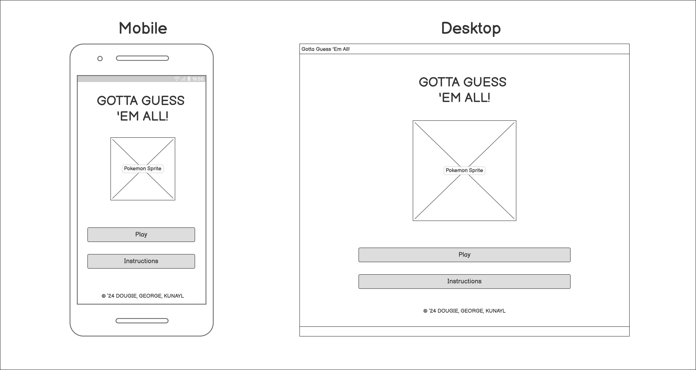
Page the user will initially reach

## Instructions Modal
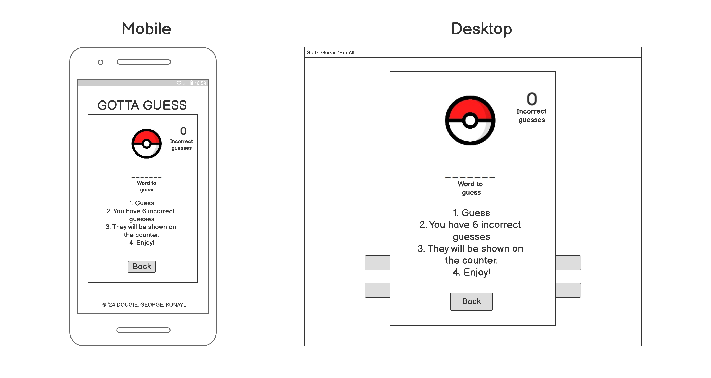
Instructions modal launched on the homepage

## Game Screen
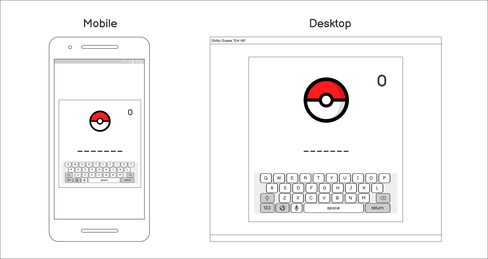
Game interface design

## Game Success
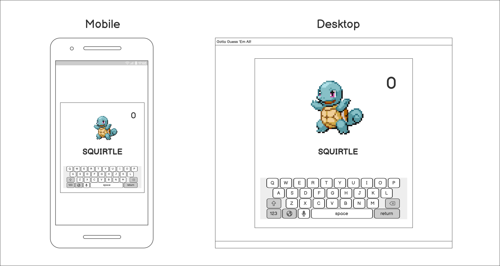
Completed game - sprite of the guessed Pokemon is shown

# Assets
We chose assets that were in-keeping with the Pokemon aesthetic.

## Fonts
We chose the 'PocketMonk' and 'Pokemon Classic' fonts for this project. 

## Colour Scheme

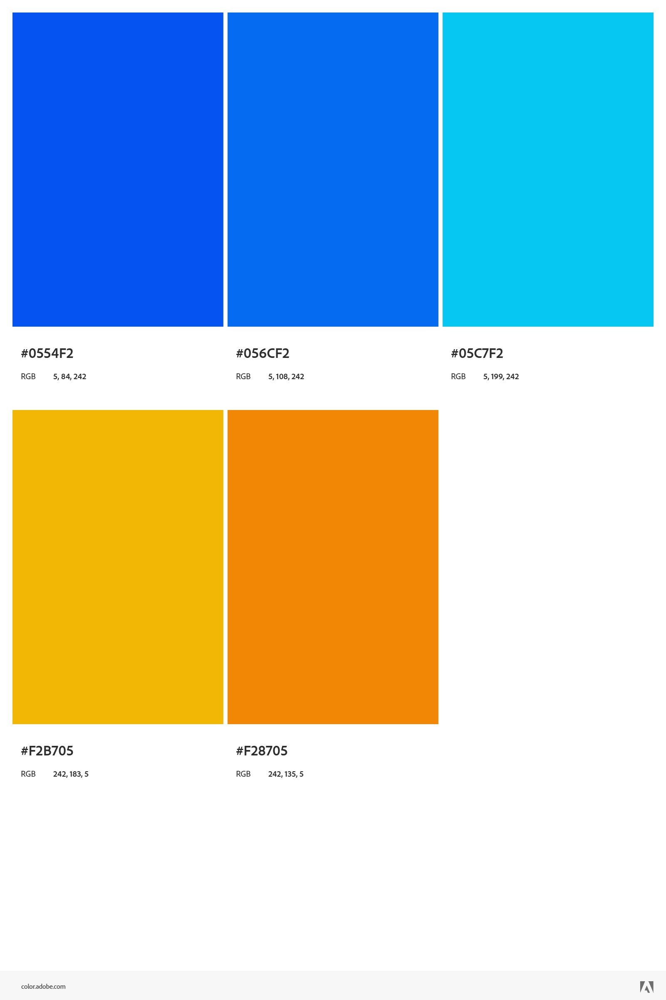

A colour scheme similar to the branding of the original Pokemon was used. This was taken from Adobe Colours. 

### Pokemon Classic

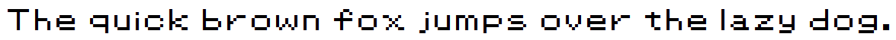

We chose this font as a nod to the original Gameboy games. We think that our target audience will recognise this font, adding nostalgia value.

### Pocketmonk


Drawing on the design language of Pokemon, we chose this font.

### Licensing
Pocketmonk is used under "non-commercial" lisence purposes. See license file <a href="assets/images/font_license.pdf">here.<a/>
Pokemon Classic was used under permission from the author.

## API

We chose the Pokeapi (pokeapi.co). The API is free and open to use under the terms of it's <a href="https://pokeapi.co/docs/v2">fair use policy</a>. It contains tens of thousands of invidiual items including name, sprites, moves and abilities. The wealth of information on offer gives us a large scope in terms of future potential features.

## NES.css Library
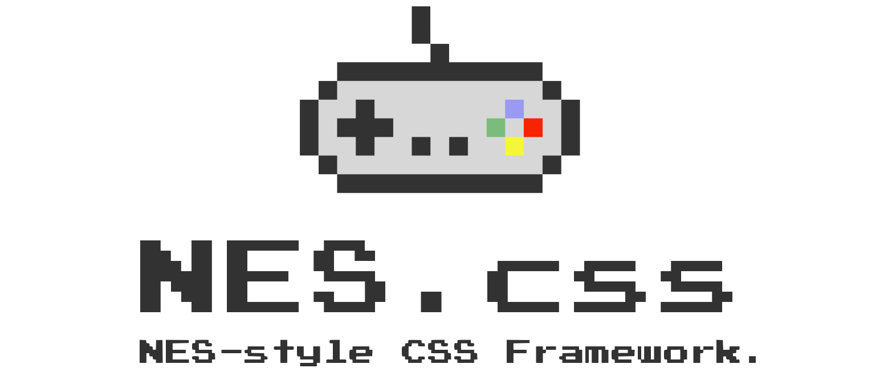
Drawing on our nostaligic theme, we found an CSS library which applies retro styling. The library includes styled buttons with animations, which we applied to our interface.

# Game Functionality

## Targetted elements in the HTML
The code first identifies and links to specific elements on the webpage that are essential for the game, such as:
- wordElement: Where the hidden word is displayed (e.g., "_ _ _ _ a _ _").
- alphabetContainer: The area for the clickable alphabet buttons.
- wrongLettersElement: The section showing incorrect guesses.
- guessesLeftElement: The display for remaining guesses.
- pokemonImage: The space for the Pokemon image.
- messageElement: The area for game messages (e.g., "You win!").
- playAgainButton: The button for restarting the game.
- pokemonStats: The section for displaying Pokemon stats.

## Variables
- randomId: A randomly generated number to select a Pokemon (between 1 and 150).
- randomWord: The chosen Pokemon's name (the word to be guessed).
- randomImage: The URL of the Pokemon's image.
- correctLetters: An array to keep track of correctly guessed letters.
- wrongLetters: An array to store incorrect guesses.
- guessesLeft: The number of attempts the player has left (starts at 10).

## Selecting a Random Pokemon:
The generation selector function allows players to choose a specific Pokémon generation to limit the pool of Pokémon for the game. When a new generation is selected from the dropdown menu (`generation-select`), an event listener triggers, retrieving the selected value. This value is used to map the generation to a specific ID range via the `generationRanges` object. A random Pokémon ID is then generated within that range, and the `fetchPokemon()` function is called to fetch a Pokémon from the chosen generation. This provides variety and ensures that the Pokémon are specific to the user’s selected generation.

The code fetches data about this Pokemon from the PokeAPI using its ID.
Special cases exist for Pokemon with hyphens ("Nidoran-f," "Nidoran-m," "Mr-Mime") to make the guessing process easier.
The Pokemon's name, image, and stats are extracted from the API data.
The initializeGame function sets up a new game round with the selected Pokemon.

## Starting the Game:
The initializeGame function preps the game for a new round:
Arrays for correct and incorrect letters are reset, and the guess count is reset to 10.
The Pokemon image is initially set to a Pokeball image.
Game messages are cleared, and the "Play Again" button is hidden.
The display is updated to show the initial game state (blank spaces for the word, the number of guesses remaining).
Functions displayWord and createAlphabetButtons are called to set up the word display and create the alphabet buttons for guessing.

## Playing the Game:
- The displayWord function shows the Pokemon name with unguessed letters as underscores:
- The randomWord is split into individual letters.
- If a letter has been correctly guessed, it's displayed; otherwise, an underscore represents it.
When all letters are guessed correctly:
- A congratulatory message appears.
- The hidden Pokemon image is revealed.
- The Pokemon's stats (type, height, weight, abilities) are displayed.
- The Pokemon's cry is played.
- The endGame function is called to conclude the round.
- The createAlphabetButtons function generates clickable buttons for each letter of the alphabet.
- The handleGuess function processes each letter guessed by the player:
- The clicked button is disabled to prevent duplicate guesses.
- If the guess is correct, it's added to the correctLetters array, and the displayWord function updates the display.
- If the guess is wrong, it's added to wrongLetters, the remaining guess count decreases, and the relevant displays are updated.
- If the player runs out of guesses, a game over message reveals the Pokemon's name, and the endGame function is called.

## Ending and Restarting the Game:
The endGame function disables all letter buttons and reveals the "Play Again" button.
Clicking the "Play Again" button triggers fetchPokemon to choose a new Pokemon and begin a new round.

## Pokemon Cries:
The code plays the Pokemon's distinctive cry when the player guesses the name correctly. This is achieved using the https://pokemoncries.com website.
When a Pokemon is correctly guessed:
A new audio element (const audio) is created using the Pokemon's randomId. The cry audio file is retrieved directly from the https://pokemoncries.com website.
The audio.play() function then plays the Pokemon's cry sound.

# JavaScript Features

## 1. Handling Awkward Pokémon Names
Some Pokémon names in the PokéAPI dataset include special characters or alternate forms that could cause issues when matching or displaying names. To handle these, we implemented a data map for name overrides.
For example:

"nidoran-f" and "nidoran-m" are standardized to "nidoran".
Alternate forms like "mr-mime", "lycanroc-midday", and "deoxys-normal" are simplified to "mrmime", "lycanroc", and "deoxys".
This ensures consistent handling of Pokémon names across different parts of the game.
```javascript
...        "iron-hands": "ironhands",
        "iron-jugulis": "ironjugulis",
        "iron-moth": "ironmoth",
        "iron-thorns": "ironthorns",
        "wo-chien": "wochien",
        "chien-pao": "chienpao",
        "ting-lu": "tinglu",
        "chi-yu": "chiyu",
        "roaring-moon": "roaringmoon",
        "iron-valiant": "ironvaliant",
        "walking-wake": "walkingwake",
        "iron-leaves": "ironleaves"
      };
      
      if (nameOverrides[data.name.toLowerCase()]) {
        randomWord = nameOverrides[data.name.toLowerCase()];
      } else {
        randomWord = data.name.toLowerCase();
      }
```
## 2. Generation Selector
To give players the option to choose Pokémon from specific generations, we created a generation selector. Each generation corresponds to a specific range of Pokémon IDs, defined in a generationRanges object. For example:

Generation 1: IDs 1-151
Generation 2: IDs 152-251
Generation 10 (all generations): IDs 1-1010
When a generation is selected, the code dynamically calculates a random ID within the chosen range and fetches the corresponding Pokémon.

## 3. Dynamic Pokémon Sound Effects
Pokémon sound effects (cries) are played dynamically by constructing a URL based on the Pokémon's ID. Since the sound file structure differs for IDs below and above 650, the code intelligently selects the correct URL:

For IDs < 650, the URL is:
https://pokemoncries.com/cries-old/{id}.mp3

For IDs >= 650, the URL is:
https://pokemoncries.com/cries/{id}.mp3

This ensures the correct sound effect is played, regardless of the Pokémon's ID.

## 4. Using Optional Chaining for Error Prevention
The PokéAPI does not guarantee that all Pokémon have multiple abilities, which can cause errors when trying to access properties like data.abilities[1].ability.name. To handle this, we used optional chaining (?.), which safely checks for the existence of these properties:


```javascript
pokemonAbility1 = data.abilities[0]?.ability.name || 'N/A';
pokemonAbility2 = data.abilities[1]?.ability.name || 'N/A';
```
If the ability or index does not exist, the code gracefully falls back to "N/A". This prevents runtime errors and ensures a smooth user experience.


# Validation

## HTML
### Index Page
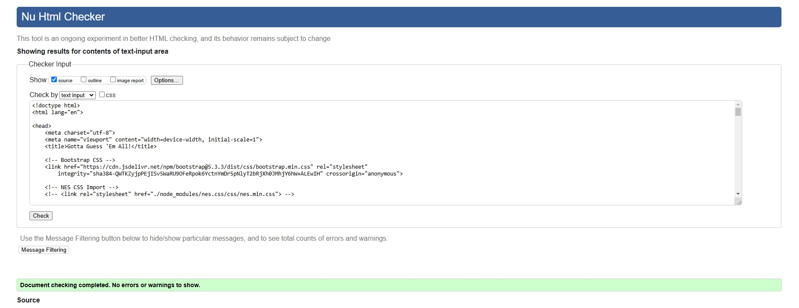

### Game Page
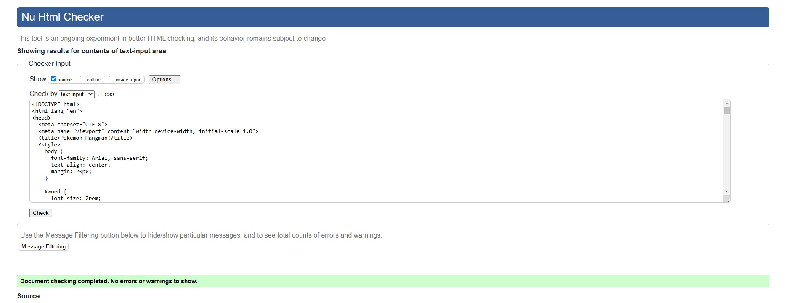

## Lighthouse
### Index
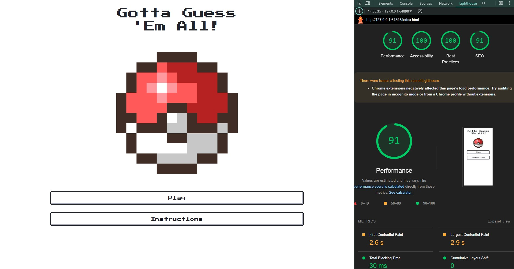

### Game Page
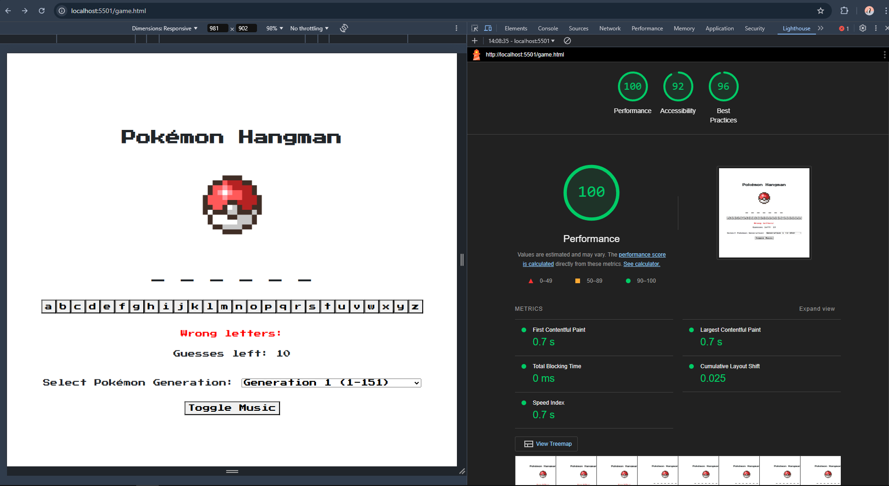

# Summary
Our project combines several elements to create an engaging Pokemon guessing game:
- It uses the PokeAPI to dynamically select Pokemon and retrieve their information.
- It provides visual feedback with letter reveals, image displays, and stat reveals.
- It adds an auditory element for a more immersive experience by playing the iconic Pokemon cries from an external source.
- It offers replayability by allowing users to play again with different Pokemon.
